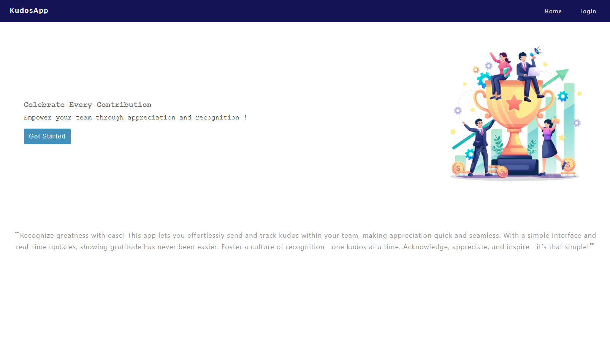
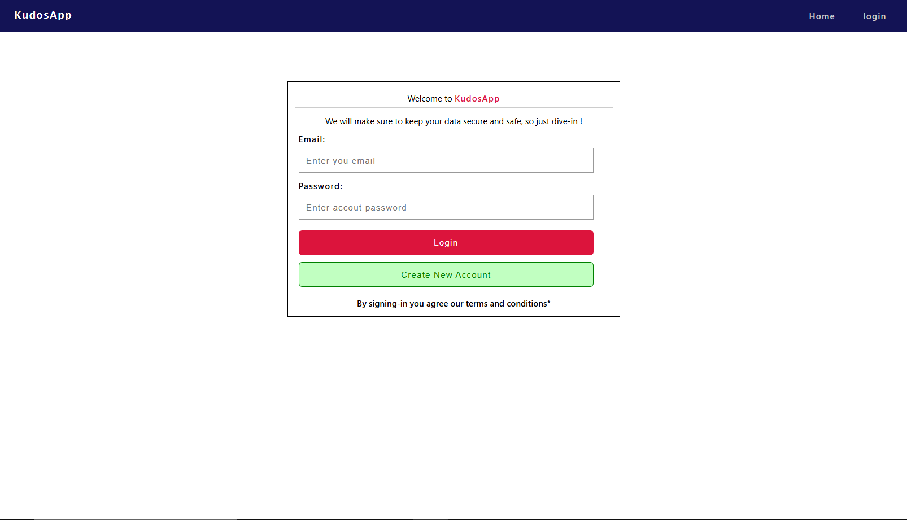
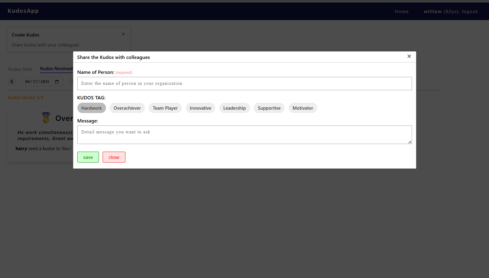
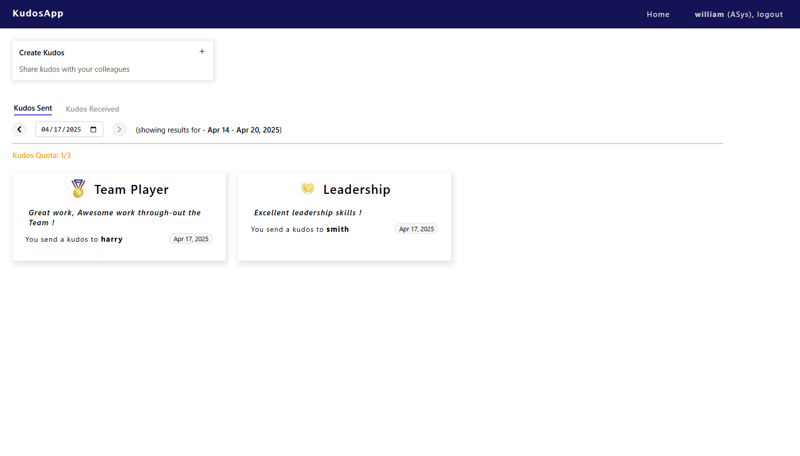
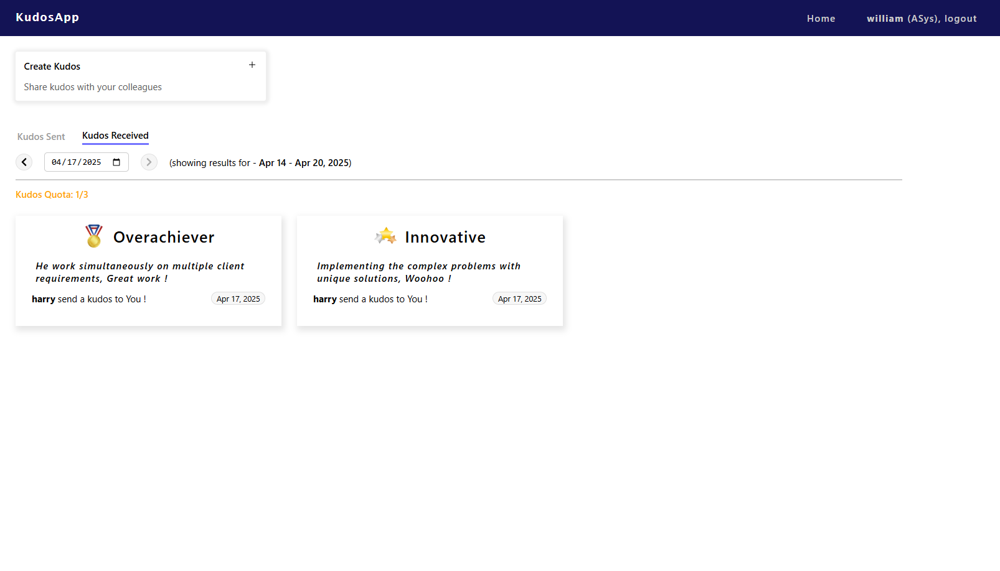

The **KudosApp** is a web application that allows users to give kudos to other users within their organization. Each user is allowed to give 3 kudos every week. The app helps promote positive reinforcement and recognition in workplace environments.

**Features**
<ul>
  <li>Users belong to an organization.</li>
  <li>Each user can give 3 kudos per week to others in the same org.</li>
  <li>Kudos include a custom message.</li>
  <li>Users can:</li>
  <ul>
    <li>See sent and received kudos, filtered by week.</li>
    <li>View their organization and username.</li>    
  </ul>
  <li>Clean, React-based interface with JWT authentication.</li>
</ul>

Lets begin the setup by cloning the repository.
## Clone the Repository
```bash
git clone https://github.com/SwaroopKhot/kudos-app.git
cd <project-directory>
```

### Backend Setup:
Let step-up the backend first

#### Step 1: Navigate to the Backend Folder
```bash
cd backend
```

#### Step 2: Create a Python Virtual Environment:
For Windows:
```bash
python -m venv venv
venv\Scripts\activate
```

For macOS/Linux:
```bash
python3 -m venv venv
source venv/bin/activate
```

#### Step 3: Install Dependencies:
Once the venv is setup, you can install the packages using the cmd below:
```bash
pip install -r requirements.txt
```

#### Step 4: Run the Django Server:
```bash
python manage.py runserver
```

The backend will typically run at: http://127.0.0.1:8000


Now, we shall begin setting-up the frontend.
### Frontend Setup
#### Step 1: Navigate to the Frontend Folder
```bash
cd frontend
```

#### Step 2: Install Node Modules
```bash
npm install
```

#### Step 3: Start the React Application
```bash
npm start
```

Done, once the setup if completed you can see the frontend at: http://127.0.0.1:3000


### ScreenShots of Kudos-App:

Here are some screenshot of the kudos app
#### Home Page:
The Homepage of Kudos-app
<p></p>

#### Login Page:
Simple login interface where users can sign in using their registered email and password.
<p></p>

#### Create Kudos:
Users can send kudos to colleagues in their organization with a short message of appreciation
<p></p>

#### View Sent Kudos:
Displays a list of all kudos you've sent during the selected week.
<p></p>

#### View Kudos Received:
Displays a list of all kudos you've received during the selected week.
<p></p>


